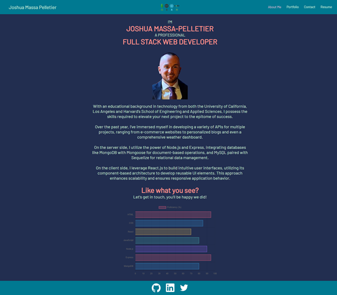
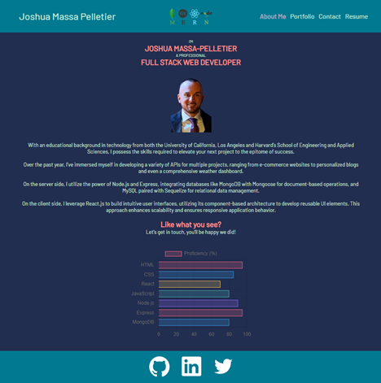
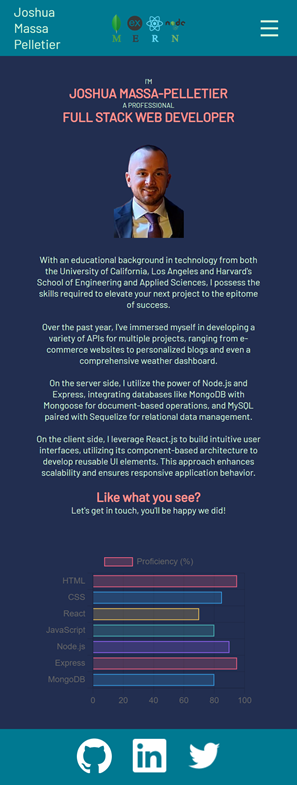

# React Portfolio for Joshua Massa-Pelletier

## Overview
An interactive portfolio built with React that showcases various components and features to provide a comprehensive display of personal projects, skills, contact information, and a downloadable resume. 

## Table of Contents
- [Features](#features)
- [Application Screenshots](#application-screenshots)
- [Deployed Application](#deployed-application)
- [Questions](#questions)
- [Credits](#credits)

## Features

1. Header

    * The header component serves as the main navigational bar for my portfolio, providing a streamlined and easily accessible way for users to explore the different sections of the webpage. It integrates the Navigation component, as well as a 'hidden' easteregg feature passed to the Navigation component as a prop.

2. About Me

    * Provides a detailed overview of my professional background, skills, and expertise as a Full-Stack Web Developer. This section also features a skill chart to visually display my level of competency in specific areas of web development.

3. Project Component

    * The project component is responsible for presenting individual project details including the project title, description, an image or gif of the project, and a GitHub Link that appear as an overlay when a user hovers over a specific project.

4. Portfolio

    * The Portfolio component in collaboration with the Project component displays a curated collection of projects, highlighting my work as a Full-Stack Web Developer. The Portfolio component is responsible for maintaining a list of project details for the Project component to render to the page.

5. Contact Me

    * The Contact Me section provides an interactive and user-friendly form for visitors to get in touch with me. This section is designed to facilitate communication and collaboration opportunities. The form contains sections for a user's Name, Email, Company, Title, and Message. The form uses a regular expression to validate the user's email in real time on blur, as well as other error handling to ensure all required fields are completed. The form also utilizes React's 'useState' hook to manage the form field values, error messages, and success messages. When a user successfully submits the form, they are notified with a success message and all form fields are reset. The success message resets after a 5 second timeout.

6. Resume

    * The Resume section provides a comprehensive overview of my technical proficiencies and offers a downloadable version of my resume for detailed reference. This section is designed to highlight my key skills and facilitate easy access to my full resume for potential employers and collaborators.

7. Footer

    * The Footer section allows for quick access to my professional social media profiles enhancing connectivity and engagement, while also providing additional resources for potential employers and collaborators to review. This includes icons that will directly navigate a user to my GitHub, LinkedIn, and Twitter profiles.

8. Easter Egg

    * The Easter Egg section features an interactive game, providing an engaging and entertaining experience for users. This section highlights the diversity of my coding abilities, expanding into game development and interactive web design. The game provides the following features:

        * A scrolling background image that creates a dynamic environment
        * A character sprite that animates and moves based on user input
        * Animated enemy sprites that move across the screen and increase the challenge of the game
        * Collision detection logic that allows for the detection of collisions between the player and enemies, ending the game if a collision occurs
        * Dynamic score tracking that resets for each new game
        * The ability to reset the game by pressing spacebar if the player collided with an enemy
        * Keyboard controls for movement using 'W', 'A', and 'D' keys

7. Technologies Used

    * JavaScript
    * React.js
    * JSX
    * CSS
    * Vite
    * Chart.js
    * Git Bash
    * GitHub
    * VSCode

## Application Screenshots

When viewed from a desktop, the app should resemble the following image:

When viewed from a tablet, the app should resemble the following image:

When viewed from a mobile device, the app should resemble the following image:

## Deployed Application
[React Portfolio for Joshua Massa-Pelletier](https://jmp-react-portfolio.netlify.app/)

## Questions
You can find my GitHub profile [here](https://www.github.com/JoshMassa). 

If you have any questions, you can email me by clicking [here](mailto:joshuamassapelletier@outlook.com).

## Credits

Skill Chart - https://www.chartjs.org/docs/latest/getting-started/

Easter Egg Game - https://www.youtube.com/watch?v=7JtLHJbm0kA